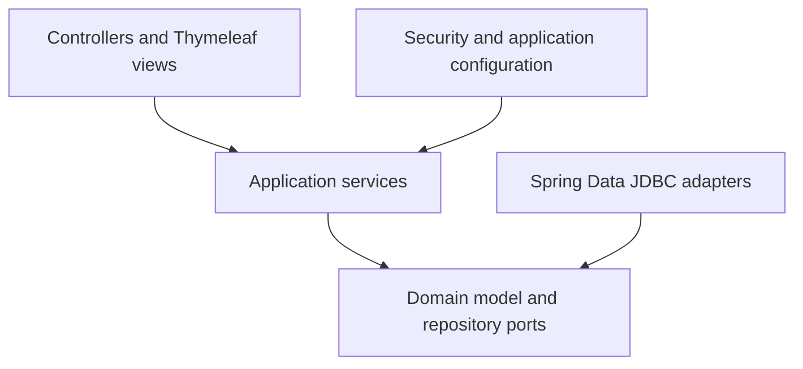

# Thesis Supervisor Finder

A server-rendered Spring Boot application that helps computer science students discover thesis topics and find supervisors whose research interests match their own.

The project was developed as a university team project and focuses on domain modelling, layered architecture, GitHub OAuth authentication, role-based workflows, and automated architecture checks.

## What the application does

### Students

- Sign in with GitHub
- Create a profile with an email address and research interests
- Add completed university courses
- Browse all available thesis topics
- Receive topic recommendations based on course prerequisites and shared interests

### Supervisors

- Request a supervisor profile
- Maintain research interests
- Publish thesis topics with descriptions and required courses

### Administrators

- Access a protected administration area
- Approve users as supervisors

## Matching logic

The recommendation flow combines eligibility and relevance:

1. Topics are filtered using the student's completed courses and the topic requirements.
2. Eligible topics are ranked by the number of interests shared by the student and the topic's supervisor.

This keeps the matching logic transparent and deterministic.

## Architecture

The codebase follows an onion-style architecture. ArchUnit tests enforce the intended dependency boundaries.



```text
src/main/java/de/hhu/propra/thesis
├── applicationlayer   # Use cases, services, DTOs, and mappers
├── config             # OAuth2 and method-security configuration
├── controller         # Spring MVC controllers
├── domain             # Domain models and repository interfaces
└── infrastructurelayer # Spring Data JDBC repository adapters
```

## Tech stack

- Java 21
- Spring Boot 3.2
- Spring MVC and Thymeleaf
- Spring Security with GitHub OAuth2
- Spring Data JDBC
- PostgreSQL for local development
- H2 as an available runtime dependency
- Gradle
- Docker Compose
- JUnit 5 and ArchUnit
- JaCoCo, Checkstyle, and SpotBugs

## Security model

- GitHub OAuth2 is used for authentication.
- Unauthenticated users can only access the landing page and static assets.
- User-specific pages verify that the GitHub identity in the URL belongs to the authenticated user.
- Admin endpoints are protected with method-level role checks.
- Administrator GitHub usernames are configured through `thesis.roles.admin`.

## Run locally

### Prerequisites

- Java 21
- Docker with Docker Compose
- A GitHub OAuth App

### 1. Create a GitHub OAuth App

In the GitHub developer settings, create an OAuth App with:

- Homepage URL: `http://localhost:8080`
- Authorization callback URL: `http://localhost:8080/login/oauth2/code/github`

Keep the generated client ID and client secret private.

### 2. Start PostgreSQL

```bash
docker compose up -d
```

The included Compose file starts PostgreSQL 15 on port `5432`.

### 3. Configure OAuth credentials

```bash
export CLIENT_ID="your-github-client-id"
export CLIENT_SECRET="your-github-client-secret"
```

To grant admin access locally, update the GitHub usernames under `thesis.roles.admin` in `src/main/resources/application.yaml`.

### 4. Start the application

```bash
bash ./gradlew bootRun
```

Open [http://localhost:8080](http://localhost:8080) and sign in with GitHub.

> [!WARNING]
> The current `schema.sql` recreates the database schema when the application starts. The setup is intended for local development and will delete existing application data.

## Tests and quality checks

Run the full verification lifecycle with:

```bash
bash ./gradlew check
```

The repository currently includes:

- Domain validation tests for tags, courses, and student profiles
- ArchUnit rules for layer annotations and onion-architecture boundaries
- JaCoCo coverage reporting
- Google-style Checkstyle rules
- SpotBugs static analysis

Some MVC controller test classes are present as work in progress but are currently disabled.

## Current status

This is a portfolio and university project, not a production-ready service. Useful next improvements include enabling the MVC test suite, adding service-level tests for the matching algorithm, introducing database migrations, and adding continuous integration.

## Authors

- [Firas Tounsi](https://github.com/firastounsi-ui)
- [Mouhib Kaabchi](https://github.com/mouhibkaabachi)
